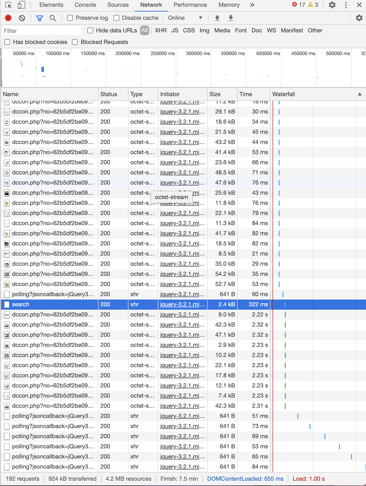
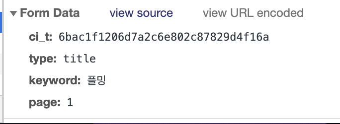

# 에피소드 1. 공식 문서가 없는 API를 사용해봅시다.

API를 뜯을 사이트는 디씨인사이드 디시콘 API입니다.
이 강의는 Chrome 브라우저로 진행됩니다.

1. 디시인사이드 아무 게시물에 들어갑니다.

2. 개발자 도구를 열고 새로고침을 한 뒤에 Network 버튼을 클릭합니다.

3. 그리고 디시콘 (CSS Query Selector: '.btn_white.small.tx_dccon') 버튼을 누릅니다.

4. 한번 디시콘 창에서 홈을 누르고 검색을 해봅시다.

5. Network를 보시면

이렇게 나와있을겁니다. 여기서 search를 누르면

Form Data에 저런 식으로 나올겁니다. (ci_t는 다를 수 있습니다.)

6. 한번 저렇게 요청을 (POST) 날려봅시다.
아무것도 안 올겁니다. 왜냐고요? 디시인사이드에서 헤더에 X-Requested-With가 XMLHttpRequest가 아니면 안되게 했기 때문입니다. 자, 그럼 X-Requested-With를 XMLHttpRequest로 설정하고 요청을 날리면 JSON이 나올겁니다. 이것은 디시콘 데이터입니다. 축하합니다, 당신은 이제 공식 문서가 없는 Search API 사용법을 알아내셨습니다! (다른 API도 비슷할겁니다.) 